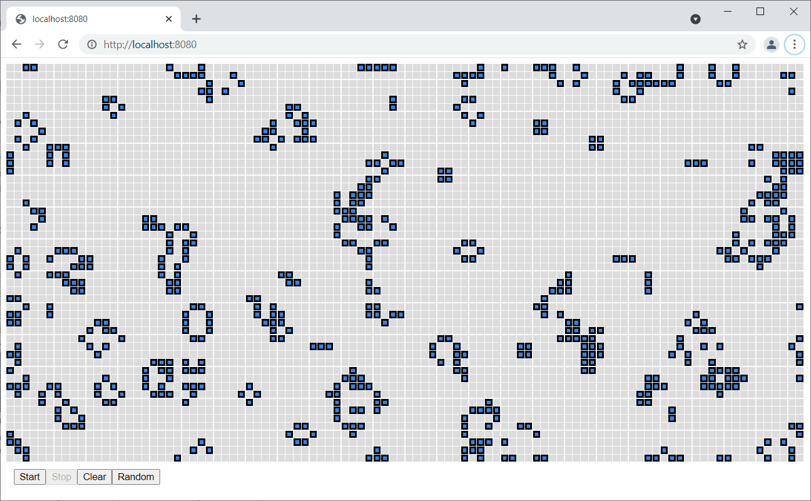

# Conway's Game of Life
A Conway's Game of Life server.

## Usage

This project requires Java 11 or newer.

```shell script
$ mvn clean package

$ java -Drsp.log.level=info -jar ./target/rsp-game-of-life-0.1-SNAPSHOT-jar-with-dependencies.jar
```

Navigate to http://localhost:8080.



## Rules

- Survivals. Every cell with two or three neighboring counters survives for the next generation.
- Deaths. Each cell with four or more neighbors dies (is removed) from overpopulation. Every cell with one neighbor or none dies from isolation.
- Births. Each empty cell adjacent to exactly three neighbors — no more, no fewer — become a birth cell.